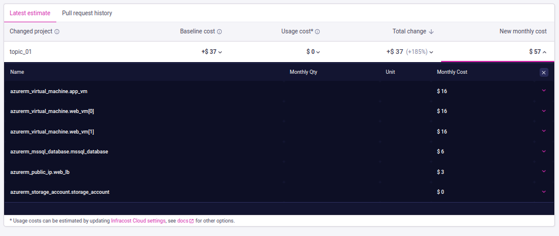

# Automate the deployment of a scalable web application in Azure using Terraform. 

### Infrastructure Requirements:
- A Virtual Network (VNet) with subnets for web, application, and database tiers. 
- Two Virtual Machines (VMs) in the web tier with a Load Balancer. 
- A VM in the application tier. 
- An Azure SQL Database in the database tier. 
- A Network Security Group (NSG) with appropriate rules for each tier. 

### Automation: 
- Write Terraform scripts to deploy the above infrastructure. 
- Ensure the infrastructure is highly available and scalable.

# Solution:

With regard to the network in general, the following have been configured: 

- VNet with the appropriate subnets 
- Network Security Groups (NSGs) and Association of NSGs

Configure the following resources separately:

- VMs and Load Balancer at Web Level
- VM at the Application Level
- Azure SQL Database at Database Level

They already have separate files and use variables to make the code more dynamic and easier to change.

### If you have a problem removing it, just run the destroy command one more time.

## Images:

- Estimated cost of adding resources using **[Infracost](https://www.infracost.io/)**:

- Hand-drawn diagram by **Drawio**:

- Resources in **Azure Portal**:
