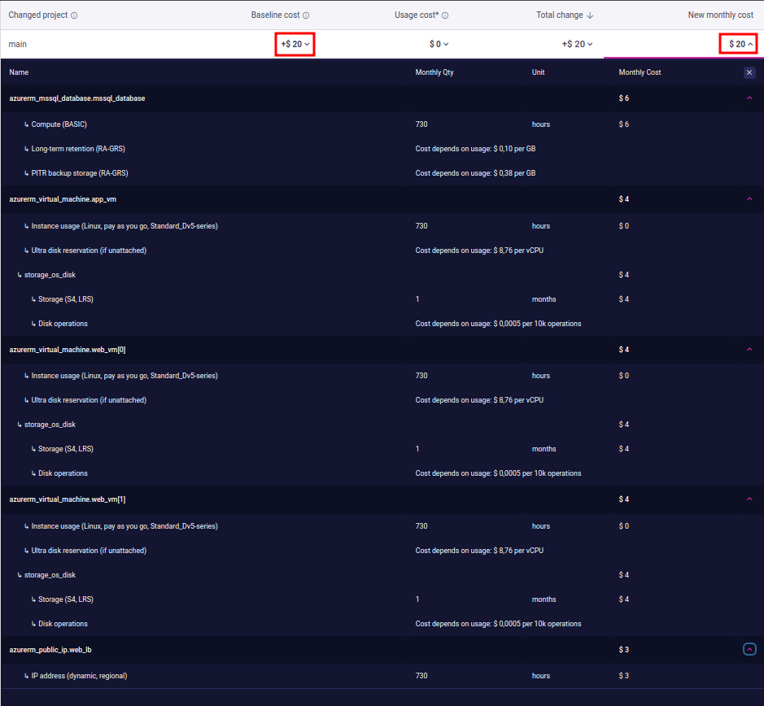
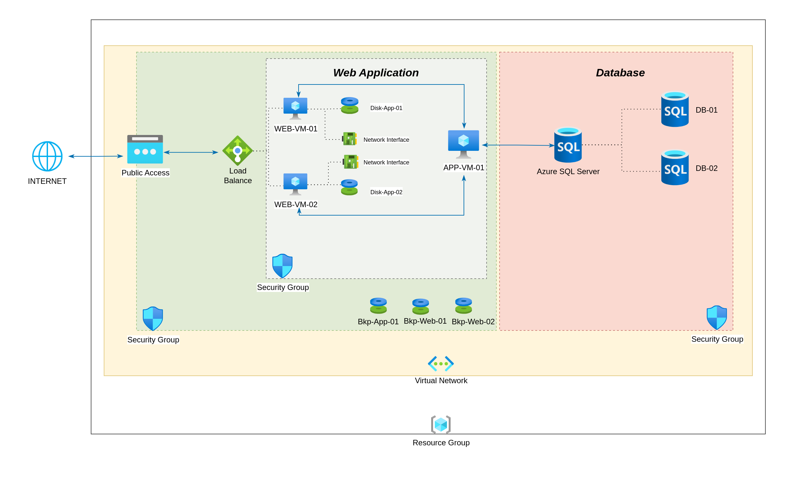
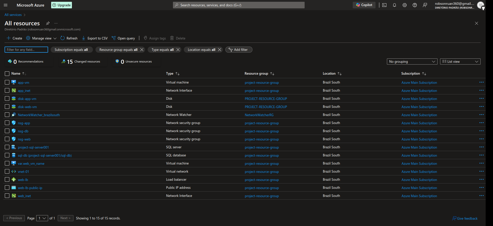

# Automate the deployment of a scalable web application in Azure using Terraform. 

### Infrastructure Requirements:
- A Virtual Network (VNet) with subnets for web, application, and database tiers. 
- Two Virtual Machines (VMs) in the web tier with a Load Balancer. 
- A VM in the application tier. 
- An Azure SQL Database in the database tier. 
- A Network Security Group (NSG) with appropriate rules for each tier. 

### Automation: 
- Write Terraform scripts to deploy the above infrastructure. 
- Ensure the infrastructure is highly available and scalable.

# Solution:

- 
    - !
    - !
    - !

- Estimated cost of adding resources using **[Infracost](https://www.infracost.io/)**:

- Hand-drawn diagram by **Drawio**:

- Resources in **Azure Portal**:
